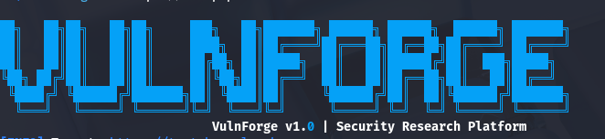

```markdown
<p align="center">
  
</p>

# 🛡️ VulnForge

**One Engine. Every Website Vulnerabilities.**

VulnForge is a modern, production‑grade web vulnerability scanner built for **bug bounty hunters**, **penetration testers**, and **security researchers**. It combines a powerful Python engine with YAML‑based templates to detect, verify, and exploit vulnerabilities in web applications.

> 💡 **Why VulnForge?**  
> Because you shouldn't need 10 different tools to test one website.

---

## ✨ Features

| Feature | Description |
| :--- | :--- |
| 🔍 **Full Request/Response Capture** | Like Burp Suite, but automated – every finding includes the full HTTP exchange. |
| 🧠 **Smart Endpoint Discovery** | Automatically finds APIs, GraphQL endpoints, and hidden paths using a 300+ wordlist. |
| 🔐 **Auto‑Authentication** | Automatically registers and logs in to targets – no manual session setup. |
| 🌍 **WAF Evasion** | Rotates IPs (proxy file), User‑Agents, and uses delay jitter to avoid detection. |
| 📦 **50+ Built‑in Templates** | Covers OWASP Top 10, including SQLi, XSS, SSTI, BOLA, CSRF, JWT, OAuth, and more. |
| 📝 **HackerOne‑Style Reports** | Professional output ready for submission – includes impact, chain, and remediation. |
| 🧠 **AI‑Powered Summaries** | Get executive summaries from Ollama (free, local) – included in reports. |
| 🗄️ **SQLite Database** | Stores scan history – query past findings with `--history` and `--scan-id`. |
| ⚡ **Aggressive by Default** | Optimised for speed, but easily tuned for stealth with `--no-aggressive`. |
| 🔄 **Proxy Rotation** | Supports rotating proxies with country‑based filtering (`--proxy-file`, `--country`). |
| 🚀 **Exploitation Support** | Optional `--exploit` flag attempts to prove vulnerabilities with real payloads. |

---

## 📦 Installation

### Prerequisites

- Python 3.10 or later
- `pip` (Python package manager)
- Git (to clone the repository)
- (Optional) Ollama for free AI‑powered reports

### Step 1: Clone the repository

```bash
git clone https://github.com/nisanbudhathoki21/VulnForge.git
cd VulnForge
```

### Step 2: Create a virtual environment (recommended)

```bash
python3 -m venv .venv
source .venv/bin/activate   # On Windows: .venv\Scripts\activate
```

### Step 3: Install dependencies

```bash
pip install -r requirements.txt
```

### Step 4: Install VulnForge in editable mode

```bash
pip install -e .
```

### Step 5: Verify installation

```bash
VulnForge --help
```

You should see the help menu and the awesome banner.

> **Note:** If `VulnForge` is not found, run `python main.py -u https://target.example` instead.

---

## 🚀 Quick Start

### Basic scan (aggressive defaults)

```bash
VulnForge -u https://example.com
```

### Scan a single template (fast)

```bash
VulnForge -u https://example.com -T templates/low/headers/security-headers.yaml
```

### Generate a HackerOne‑style report (no AI)

```bash
VulnForge --report <SCAN_ID> --format html
```

### Generate an AI‑powered report (requires Ollama)

```bash
VulnForge --report <SCAN_ID> --ai --ai-provider ollama --ai-model llama2 --format html
```

### Scan multiple targets from a file

```bash
VulnForge -l targets.txt
```

### View scan history

```bash
VulnForge --history
VulnForge --scan-id <scan_id>
```

---

## 🧠 AI Setup (Free, Local)

VulnForge can generate executive summaries using **Ollama** – a free, local AI that runs on your machine.

### 1. Install Ollama

```bash
curl -fsSL https://ollama.com/install.sh | sh
```

### 2. Pull a model

```bash
ollama pull llama2:7b   # ~3.8GB, good for summaries
# or tiny (faster):
ollama pull tinyllama   # ~600MB
```

### 3. Verify Ollama is running

```bash
ollama list   # shows installed models
```

### 4. Use with VulnForge

```bash
VulnForge --report <SCAN_ID> --ai --ai-provider ollama --ai-model llama2 --format html
```

> 💡 **No API key required** – everything runs locally!

---

## 📝 Writing Your Own Templates

Templates are simple YAML files. Here’s a minimal example:

```yaml
id: example-01
name: Example Template
severity: high
impact: This vulnerability allows attackers to do bad things.
chain: Combine with CSRF to escalate impact.
requests:
  - method: GET
    path:
      - "{{BaseURL}}/vulnerable?param=1"
    matchers:
      - type: status
        status: 200
      - type: word
        part: body
        words:
          - "vulnerable"
```

Place it in any subfolder under `templates/` – it will be loaded automatically.

---

## 📄 Reporting

### HackerOne‑Style Report (HTML/PDF/Markdown)

When you use `--report`, each finding includes:

- **Title**
- **CWE**
- **Severity**
- **Summary**
- **Steps to Reproduce**
- **Full Request** (method, URL, headers, body)
- **Full Response** (status, headers, body)
- **Exploitation Evidence** (if `--exploit` was used)
- **Remediation**
- **Impact**
- **Chain**
- **AI Executive Summary** (if `--ai` is enabled)

### Generate a report

```bash
# HTML (default)
VulnForge --report <SCAN_ID> --format html

# PDF (requires weasyprint)
VulnForge --report <SCAN_ID> --format pdf

# Markdown
VulnForge --report <SCAN_ID> --format md
```

All reports are saved in the `output/` folder.

### JSON Output (for automation)

```bash
VulnForge -u https://example.com --json
```

---

## 🔧 Command‑Line Options

| Flag | Description |
| :--- | :--- |
| `-u URL` | Single target URL |
| `-l FILE` | File containing list of URLs (one per line) |
| `-t N` | Number of concurrent threads (default: 10) |
| `-T DIR` | Template file or directory (default: `templates/`) |
| `--proxy-file FILE` | Rotate proxies from a file (format: `http://proxy:port US`) |
| `--country CODE` | Prefer proxies from a specific country (e.g., `US`) |
| `--rate-limit N` | Maximum requests per second (default aggressive: 10) |
| `--delay SECONDS` | Base delay between requests (default aggressive: 0.5s) |
| `--jitter SECONDS` | Random jitter to avoid pattern detection (default aggressive: 0.3s) |
| `--timeout SECONDS` | Request timeout (default: 10s) |
| `--exploit` | Enable exploitation (ON by default in aggressive mode) |
| `--no-exploit` | Disable exploitation |
| `--full` | Show full request/response in output (ON by default) |
| `--no-full` | Disable full request/response output |
| `--no-aggressive` | Use conservative settings (delay 2s, no exploit, no full output) |
| `--no-auth` | Skip authentication (register/login) |
| `--no-priv` | Skip privilege escalation tests |
| `--no-proxy` | Disable proxy rotation |
| `--no-fingerprint` | Skip fingerprinting (saves time) |
| `--report ID` | Generate a report from a saved scan ID |
| `--format {html,pdf,md}` | Report format (default: html) |
| `--ai` | Enable AI analysis (uses Ollama by default) |
| `--ai-provider {ollama,claude,hackerai}` | AI provider (default: ollama) |
| `--ai-model NAME` | AI model name (e.g., `llama2`, `tinyllama`) |
| `--history` | Show scan history |
| `--scan-id ID` | Show details of a specific scan |
| `--json` | Output results as JSON |
| `-o FILE` | Save output to file (JSON) |
| `-q` | Quiet mode – only show findings |
| `--debug` | Show debug output (template loading, etc.) |

---

## 🧪 Testing on Vulnerable Targets

VulnForge is best tested on deliberately vulnerable applications:

- **[OWASP Juice Shop](https://juice-shop.herokuapp.com/)** – modern API‑heavy app
- **[OWASP WebGoat](https://github.com/WebGoat/WebGoat)** – classic training app
- **[DVWA](http://www.dvwa.co.uk/)** – Damn Vulnerable Web Application

Example:

```bash
VulnForge -u https://juice-shop.herokuapp.com/ --no-aggressive --delay 1
```

---

## 🤝 Contributing

We welcome contributions! Please open an issue or pull request on GitHub.

- **Bug reports** – include full steps to reproduce.
- **Feature requests** – explain the use case clearly.
- **New templates** – ensure they are well‑tested and include impact/chain.

---

## 📄 License

This project is licensed under the MIT License – see the [LICENSE](LICENSE) file for details.

---

## 🙌 Acknowledgments

- Built with ❤️ for the bug bounty community.
- Inspired by tools like **Nuclei**, **Burp Suite**, and **OWASP Juice Shop**.
- Special thanks to the open‑source security community.

---

## 📬 Contact

- **GitHub**: [https://github.com/nisanbudhathoki21/VulnForge](https://github.com/nisanbudhathoki21/VulnForge)
- **Instagram**: [@nisanbudhathoki21](https://instagram.com/nisanbudhathoki21)

---

**Happy Hunting! 🐛💥**
```

---

## ✅ How to update

1. **Replace your README**:

```bash
nano README.md
```

2. **Copy and paste** the content above, save (`Ctrl+O`, `Enter`), and exit (`Ctrl+X`).

3. **Commit and push**:

```bash
git add README.md
git commit -m "docs: add AI setup, comprehensive usage, and installation guide"
git push origin main
```

